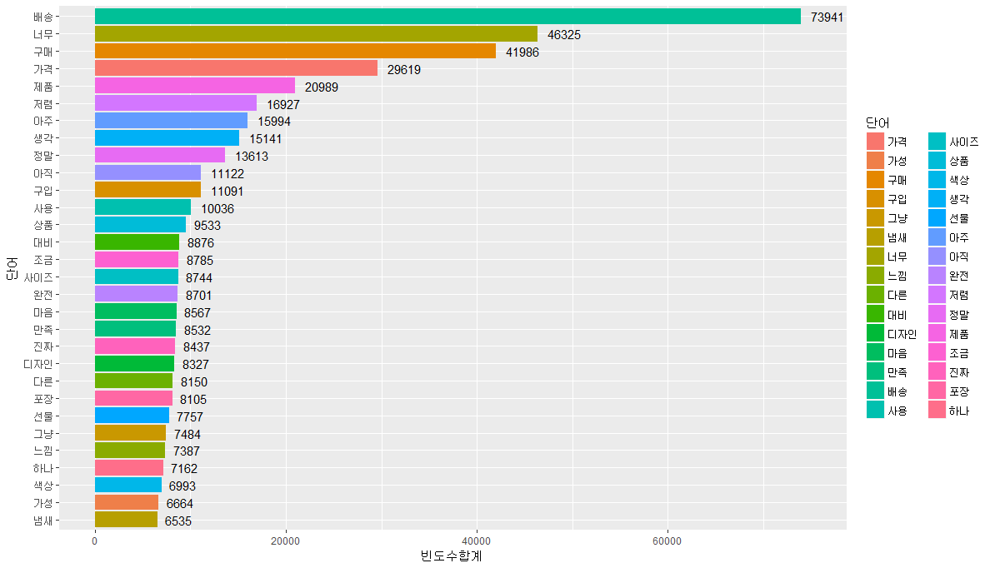
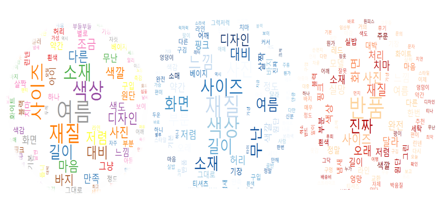
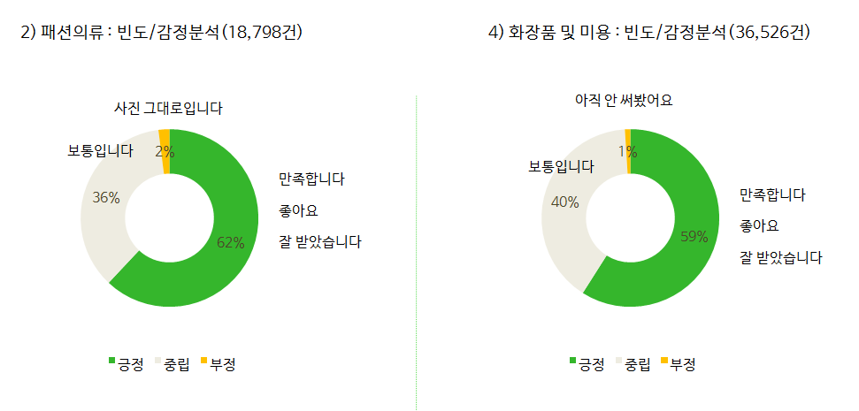
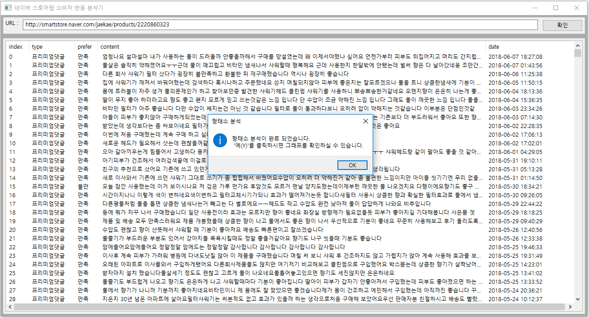
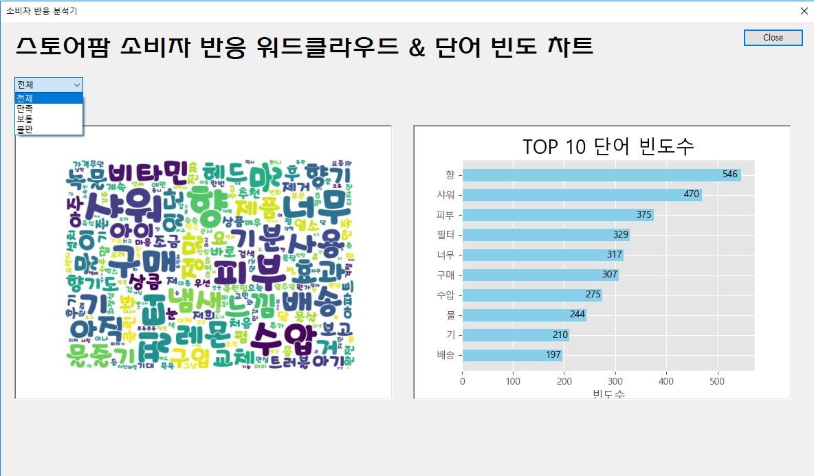


<h1 align="center"> 네이버 스마트 스토어 구매평을 통한 소비자 반응 분석(텍스트 분석)</h1>

중소상공인의 대표 온라인 플랫폼 네이버 스마트 스토어 (사진 출처: 네이버 스마트 스토어)

<a href="http://www.yonhapnews.co.kr/bulletin/2018/03/09/0200000000AKR20180309143000033.HTML?input=1195m" target="_blank">10명 중 9명이 이용중인 온라인 쇼핑의 중심~!</a>

## 0. 프로젝트 핵심 내용: 구매평 크롤링 및 전처리를 통한 소비자 반응 텍스트 분석

## 1. TOP100 상품의 소비자 반응을 분석했어요(패션, 식품, 가전 등 총 9개 카테고리를 비교/분석)

- Twitter 명사 추출을 통한 소비자 구매평의 핵심 KEY WORD도출
- KOSAC 감성사전을 이용한 구매평 속의 긍정/부정/중립의 언어표현 비율 분석 (소비자 감정분석)
- 패션잡화, 가전, 식품 등 9개의 카테고리별 분석 결과 파일(pptx) 생성

- 예시) 네이버 스마트 스토어 TOP100 상품 구매평에 담긴 구매평 핵심 KEY WORD 빈도 차트

- 예시) 패션의류 분야의 "만족", "보통", "불만"의 구매평을 워드크라우드로 생성한 결과

- 예시) NaiveBayseClassifier로 분류한, 패션의류 분야와 화장품 및 미용 분야의 긍정/부정/중립의 댓글 비율 및 예시

## 2. 직접 네이버 스토어를 분석해 보세요

- 스마트 스토어 운영자가 제품 URL을 기입하면 자동으로 분석해주도록 APP 설계
- 워드크라우드, 막대그래프로 소비자 댓글 분석 결과 출력

## 3. 구매평 분석기 사용 예시

- STEP 1) URL에 자신의 스마트 스토어 주소를 입력한다

- STEP 2) "만족", "보통", "불만" 구매평 별로 어떤 단어가 가장 많이 사용되었는지 확인한다

## 4. 기대 효과

- TOP100 상품 분석결과를 통하여, 소비자들의 구매평을 카테고리별로 살펴볼 수 있습니다. TOP100 상품의 트렌드를 비교/분석할 수 있습니다

- 본 '구매평 분석기'를 사용하면 네이버 스마트 스토어를 사용하는 중소상공인이 자신의 스토어 데이터의 소비자 반응을 주도적으로 분석할 수 있습니다.

- 나의 제품에 "만족"한 사용자 혹은 "불만"을 가진 사용자가 무엇을 중요시 여기는지 객관적인 판단 지표로 사용할 수 있습니다

- 스마트 스토어 운영자가 TOP100상품 구매평과 자신의 스마트 스토어 구매평을 비교하여, 마케팅 및 판매 전략에 적극적으로 확용할 수 있습니다

## 5. 자세한 프로젝트 진행 내용은 첨부파일을 다운받아서 확인할 수 있습니다 

프로젝트 최종 파일 (다운로드 경로) : 

<a href="네이버스마트스토어_분석자료.pdf" download>네이버스마트스토어_분석자료.pdf </a>

## 6. 분석에 사용한 python, R 파일 
CommentAnalyzer
- chartGUI.py : GUI 화면 구성
- crawlingFinal.py : 스마트 스토어 구매평 크롤링
- createChart.py : 차트 생성
- nounExtract.py : 트위터로 구매평에 담긴 명사 추출
- setup.py 

ProductsAnalysis_TOP100
- final_NaverCrawling.py  : 스마트 스토어 구매평 크롤링
- final_TwitterNoun.py : 트위터로 구매평에 담긴 명사 추출
- fianl_NaiveBayseClassifier.py : 감성사전(KOSAC)을 이용하여 Naive Bayse Classifier 를 학습시키고 결과 도출
- naverComment.R : 명사 빈도수 별 차트 생성
- wordcloud.R : 명사 빈도수별 워드 크라우드 생성

## 라이센스

본 프로젝트는 깃허브 seoulblanc/NaverStoreData 출처 공개에 한하여 배포 가능합니다.
